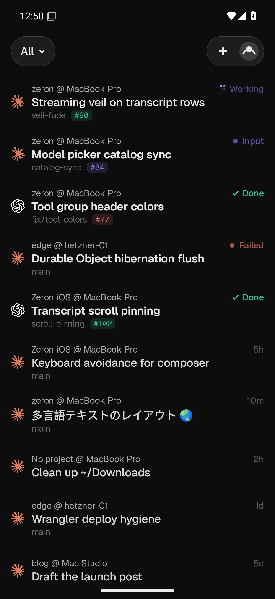
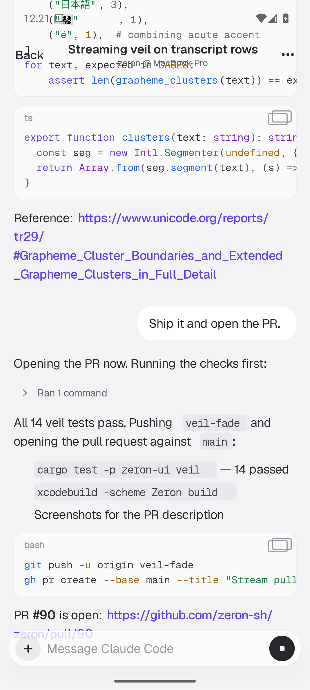
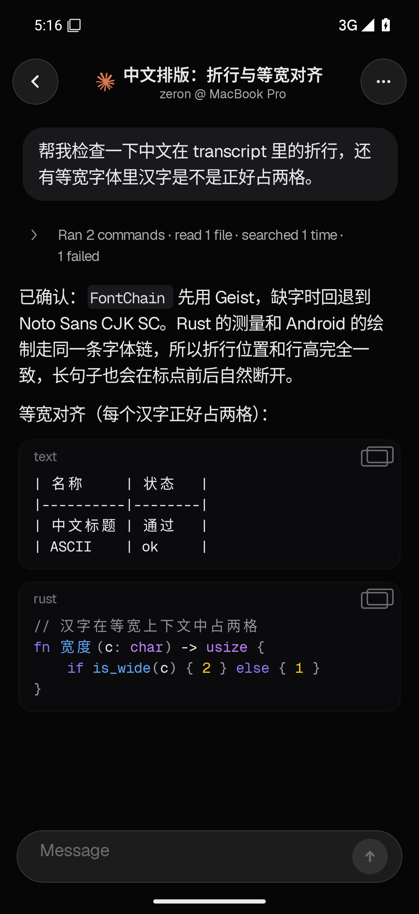
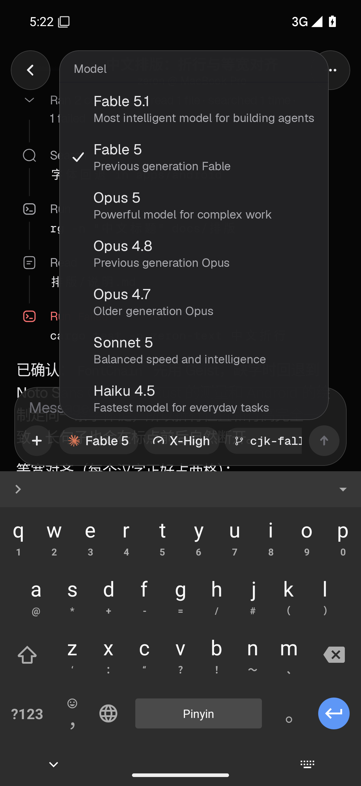

# Zeron for Android

An unofficial Android client for [Zeron](https://github.com/zeronsh/zeron), rebuilt screen by screen from the official iOS app.

*English | [简体中文](README.zh-CN.md)*

<p>
  
  
  
  
</p>

Zeron controls coding agents (Claude Code, Codex, Cursor and others) through a small engine running on your computer. Upstream ships a desktop app and an iOS app, but no Android app. This repository adds one.

The app is written in Jetpack Compose and links the same Rust mobile core as the iOS app, so layout and behavior follow iOS closely. It also adds Chinese font fallback and was tested with a Chinese Pinyin keyboard.

## Status

- Offline demo workspace: works.
- Direct connection to your own Zeron engine over SSH (no Cloudflare relay needed): in progress.
- In-app updates from this repository's GitHub Releases: in progress.

## Download

Get the APK from [Releases](https://github.com/villatothesea/zeron-android-app/releases).

## Build

```bash
scripts/android/build-apk.sh
```

See [apps/android/README.md](apps/android/README.md) for requirements. The Android code lives in `apps/android` and `crates/mobile`. The rest of the tree is a copy of the upstream source.

## Upstream

For the desktop app, the engine, and multi-device sync, see the upstream repository: <https://github.com/zeronsh/zeron>.

This project is not affiliated with the Zeron maintainers. It is released under the [MIT License](LICENSE), the same as upstream, and keeps the upstream copyright notice.
