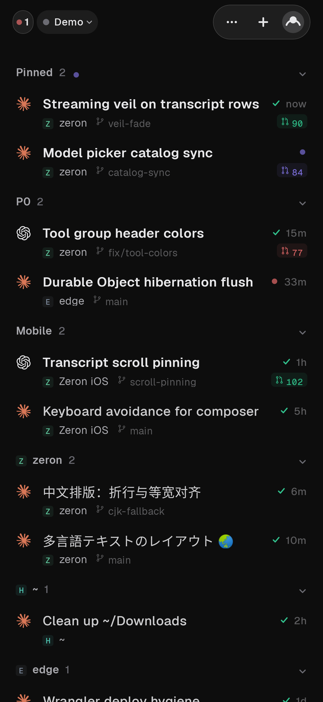
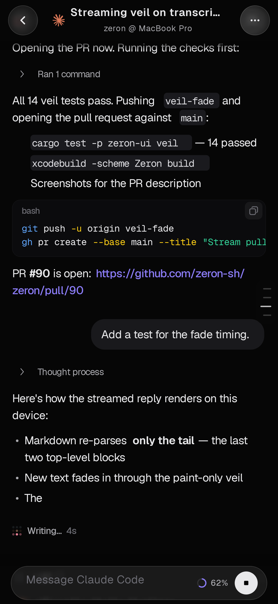
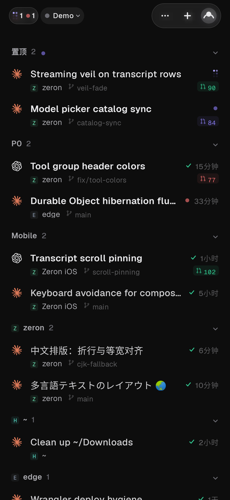
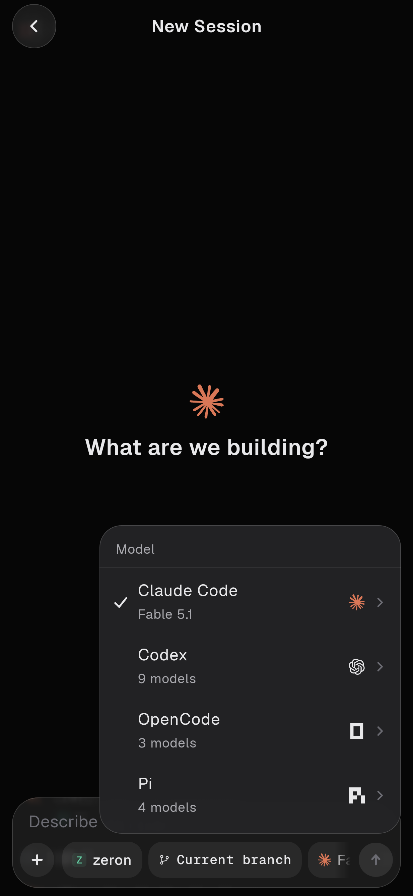

# Zeron 安卓版

[Zeron](https://github.com/zeronsh/zeron) 的非官方安卓客户端，照着官方 iOS 版逐屏复刻。

*[English](README.md) | 简体中文*

<p>
  
  
  
  
</p>

Zeron 通过电脑上的一个小引擎来管理编码 agent（Claude Code、Codex、Cursor 等）。原仓库有桌面端和 iOS 版，没有安卓版，这个仓库补上了安卓版。

app 用 Jetpack Compose 编写，和 iOS 版链接同一个 Rust 移动端核心，所以排版和行为都尽量跟 iOS 一致。另外加了中文字体回退，并用中文拼音输入法测试过。

## 当前进度

- 离线演示工作区：可用。
- 通过 SSH 直连你自己的 Zeron 引擎（不需要 Cloudflare 中转，也不需要云账号）：round5 起可用。手机登录电脑上的 OpenSSH 服务，再通过隧道连到本机 `127.0.0.1:27654` 的引擎；首次连接时需核对主机指纹。Windows 配置步骤（PowerShell）：[docs/ssh-direct.md](docs/ssh-direct.md)。消息可以带图片和文件附件（要求电脑上的 Zeron ≥ 0.2.12，太旧时 app 会提示）。共享消息队列按引擎能力决定：不支持它的旧版本上，会话忙时发送的消息会作为插话（steer）发给当前轮次。置顶和分组在手机上做的编辑只保存在手机；电脑自己的置顶会镜像显示过来（不写回电脑）。
- 从本仓库的 GitHub Releases 在 app 内更新：round5 起可用（设置 → 检查更新，另有启动时和打开期间的静默检查，约每 30 分钟一次），无需 token。round5 起所有版本使用同一个签名密钥。如果装过 round4，需要先卸载一次、手动安装最新的 APK，之后即可在 app 内直接覆盖更新。

## 把手机连到电脑

手机上的 app 本身不运行 agent，它要连到**正在运行 Zeron 桌面端的电脑**。有三种方式：

| 方式 | 适用场景 | 需要什么 |
| --- | --- | --- |
| [A. 同一 Wi-Fi / 局域网（SSH）](#a-同一-wi-fi--局域网ssh) | 手机和电脑在同一个路由器下 | 电脑开启 OpenSSH Server |
| [B. 远程（Tailscale）](#b-远程tailscale) | 手机在外面（4G/5G、别的 Wi-Fi） | 先完成 A，再在电脑和手机上装 Tailscale |
| [C. Zeron Cloud 账号](#c-zeron-cloud-账号目前不可用) | —— | 目前不可用，见下文 |

下文以 Windows 10/11 为例。所有 `<尖括号>` 里的内容都要换成你自己的值，例如 `<电脑IP>`、`<Windows用户名>`。

### 准备：电脑上保持 Zeron 运行

电脑上打开 Zeron 桌面端并保持运行即可（最小化也行）。它会在本机 `127.0.0.1:27654` 上监听，这个端口**不需要**对外开放，手机通过 SSH 隧道访问它。

想开机自动以无界面模式运行，见 [docs/ssh-direct.md 第 4 步](docs/ssh-direct.md#4-让-zeron-引擎保持运行)。

### A. 同一 Wi-Fi / 局域网（SSH）

#### A1. 开启 Windows 的 OpenSSH Server

右键点击 **开始** 按钮 → **终端(管理员)**（Windows 10 为 **Windows PowerShell(管理员)**），在弹出的确认框里点 **是**，然后逐行粘贴：

```powershell
Add-WindowsCapability -Online -Name OpenSSH.Server~~~~0.0.1.0
Start-Service sshd
Set-Service sshd -StartupType Automatic
```

检查防火墙规则（安装时一般会自动创建）：

```powershell
Get-NetFirewallRule -Name *OpenSSH-Server* | Select-Object Name, Enabled, Profile
```

没有任何输出时，手动添加：

```powershell
New-NetFirewallRule -Name OpenSSH-Server-In-TCP -DisplayName "OpenSSH Server (sshd)" -Enabled True -Direction Inbound -Protocol TCP -Action Allow -LocalPort 22
```

确认 sshd 正在运行（`Status` 应为 `Running`）：

```powershell
Get-Service sshd
```

#### A2. 把网络设为"专用网络"

Windows 在"公用网络"下会拦截来自局域网的连接。

- Windows 11：**设置 → 网络和 Internet → WLAN**（有线则点 **以太网**）→ 点当前连接的网络（"<网络名> 属性"）→ **网络配置文件类型** 选 **专用网络**。
- Windows 10：**设置 → 网络和 Internet → WLAN**（或 **以太网**）→ 点当前连接的网络 → **网络配置文件** 选 **专用**。

也可以在管理员 PowerShell 里查看和修改（把 `<网卡名>` 换成 `Get-NetConnectionProfile` 输出里的 `InterfaceAlias`，例如 `WLAN`）：

```powershell
Get-NetConnectionProfile
Set-NetConnectionProfile -InterfaceAlias "<网卡名>" -NetworkCategory Private
```

> **装了火绒或其他安全软件？** 它们有自己的网络防护，可能拦截 22 端口，即使 Windows 防火墙已放行。以火绒为例，打开 **火绒 → 防护中心 → 网络防护**，检查：
> - **IP协议控制**：如果开启了，添加一条允许 TCP 本地端口 `22` 入站的规则；
> - **联网控制**：如果开启了，放行 `sshd.exe`；
> - **暴破攻击防护**：手机多次登录失败后，可能把手机的 IP 当成攻击拦下。在拦截记录里放行，或配置好密钥后再试。
>
> 不同版本的菜单名可能略有不同。其他安全软件同理：放行 TCP 22 入站或 `sshd.exe`。

#### A3. 把手机的公钥加到电脑上

1. 手机上：点首页右上角的 **头像图标** 进入 **设置** → **账户与电脑** → 页面底部 **本机 SSH 密钥** → **复制公钥**。
2. 把这一整行发到电脑上（微信文件传输助手、邮件、QQ 等都行）。它形如 `ssh-ed25519 AAAA... zeron-<手机型号>`。
3. 电脑上，在**管理员 PowerShell** 中执行（第一行引号里粘贴刚才那一整行）：

**管理员账户**（大多数个人电脑的账户都是管理员）：公钥必须放在 `C:\ProgramData\ssh\administrators_authorized_keys`，**不是**用户目录下的 `.ssh\authorized_keys`。

```powershell
$key = 'ssh-ed25519 AAAA...把手机上复制的整行粘贴到这里...'
Add-Content -Path C:\ProgramData\ssh\administrators_authorized_keys -Value $key -Encoding ascii
icacls C:\ProgramData\ssh\administrators_authorized_keys /inheritance:r /grant "Administrators:F" /grant "SYSTEM:F"
```

> 最后一行设置文件权限。权限不对时（例如继承了 Users 的读取权限），sshd 会静默忽略这个文件，手机只会提示认证失败。

**普通（非管理员）账户**：

```powershell
$key = 'ssh-ed25519 AAAA...把手机上复制的整行粘贴到这里...'
New-Item -ItemType Directory -Force $env:USERPROFILE\.ssh | Out-Null
Add-Content -Path $env:USERPROFILE\.ssh\authorized_keys -Value $key -Encoding ascii
```

不确定自己是不是管理员？执行下面这行，输出 `True` 就是管理员：

```powershell
([Security.Principal.WindowsPrincipal][Security.Principal.WindowsIdentity]::GetCurrent()).IsInRole([Security.Principal.WindowsBuiltInRole]::Administrator)
```

#### A4. 查电脑的局域网 IP 和用户名

```powershell
ipconfig
$env:USERNAME
```

- `ipconfig`：在正在使用的网卡（**无线局域网适配器 WLAN** 或 **以太网适配器**）下找 **IPv4 地址**，形如 `192.168.x.x`，这就是 `<电脑IP>`。
- `$env:USERNAME`：输出就是 `<Windows用户名>`。用微软账户登录的电脑也填这里的输出，不要填邮箱。

> 路由器每次重启都可能给电脑分配新 IP。可以在路由器后台给电脑设置"静态 DHCP / IP 与 MAC 绑定"，IP 就不会变了。

#### A5. 在手机上添加电脑

手机上：**设置 → 账户与电脑 → 添加电脑**（或直接点 **设置 → 添加电脑（SSH）…**），按下表填写：

| 字段 | 填写 |
| --- | --- |
| 名称 | 随意，例如 `家里的电脑` |
| 地址 | 在 **地址** 一栏添加 `<电脑IP>`（A4 查到的 IPv4 地址）。一台电脑可以存多个地址（比如局域网 IP 和 Tailscale IP），app 会按当前网络自动选择、连不上就换下一个；SSH 端口不是 22 时写成 `地址:2222` |
| Zeron 端口 | `27654`（默认值，不用改） |
| 用户名 | `<Windows用户名>` |
| 登录方式 | **本机密钥**（推荐，对应 A3）/ 导入密钥 / 密码（Windows 登录密码，微软账户用微软账户密码） |

然后：

1. 点 **测试**（它会逐个尝试已保存的地址）。
2. 第一次连接会弹出 **信任这台电脑吗？**，显示 `SHA256:...` 指纹。可在电脑上核对：
   ```powershell
   ssh-keygen -lf C:\ProgramData\ssh\ssh_host_ed25519_key.pub
   ```
   两边一致就点 **信任**。
3. 看到 **已连接 · Zeron <版本> 响应用时 … ms** 后，点 **保存并连接**。

之后在 **设置 → 账户与电脑** 里点这台电脑就能切换过去。连不上时看下面的[常见问题](#常见问题)。

### B. 远程（Tailscale）

[Tailscale](https://tailscale.com/) 把你的电脑和手机组成一个私有网络，手机在任何网络下都能用一个固定的 `100.x.y.z` 地址访问电脑，不需要公网 IP，也不需要在路由器上做端口转发。**先完成 A1–A3**，这里只是把"主机"从局域网 IP 换成 Tailscale IP。

1. **电脑**：从 <https://tailscale.com/download/windows> 下载安装 → 点任务栏右下角的 Tailscale 图标 → **Log in**，在浏览器里登录（Google、微软、GitHub 账号都行）。
2. **手机**：从 Google Play 安装 Tailscale（或在 <https://tailscale.com/download/android> 下载）→ 打开 → **用和电脑相同的账号登录** → 系统询问是否允许建立 VPN 连接时点 **确定**。
3. **查电脑的 Tailscale IP**：点电脑任务栏的 Tailscale 图标，菜单里本机名称旁边显示的就是；或者在 PowerShell 里执行：
   ```powershell
   tailscale ip -4
   ```
   得到形如 `100.x.y.z` 的地址。
4. **手机上添加 Tailscale 地址**：点 **设置 → 账户与电脑**，编辑刚才那台电脑，在 **地址** 一栏里把 `100.x.y.z` 加为第二个地址——之后 app 会按当前网络自动选择：在家里的 Wi-Fi 上走局域网，在外面走 Tailscale，不用再建第二台电脑。（想分开管理的话，也可以再单独添加一台电脑。）主机密钥已经信任过，不用重新核对。

注意：

- **安卓同一时间只能开一个 VPN。** Tailscale 在安卓上就是一个 VPN，打开 Clash、v2rayNG 等代理/加速器 app 会把 Tailscale 挤掉（反之亦然）。用 Tailscale 连电脑时，先关掉手机上的代理 app。
- **电脑上开了 Clash 的 TUN 模式？** TUN 会把发往 `100.x` 的流量也抢过去，导致 Tailscale 连不通。在 Clash 规则的**最前面**加一条直连规则（Clash Verge Rev 等客户端可以写在订阅的"扩展配置/覆写"里，避免更新订阅时被覆盖）：
  ```yaml
  rules:
    - IP-CIDR,100.64.0.0/10,DIRECT,no-resolve
  ```
  使用 mihomo（Clash Meta）内核时，也可以在 `tun:` 下加 `route-exclude-address: [100.64.0.0/10]`。
- 想让电脑在锁屏、未登录时也保持 Tailscale 在线：电脑任务栏 Tailscale 图标 → **Preferences** → 勾选 **Run unattended**。

### C. Zeron Cloud 账号（目前不可用）

app 里有 **设置 → 账户与电脑 → 其他工作区 → Zeron Cloud** 这一项，它是从 iOS 版移植过来的"用 Zeron 官方账号登录、经官方中继（edge）连接"的入口。目前的实际情况：

- 本项目没有也不运营自己的中继服务；安卓端对官方中继的接入尚未实现完成，也没有经过端到端验证。点进去可能出现登录页，但登录后很可能连不上你的电脑。
- 如果将来可用，电脑端也需要先登录同一个账号并开启多设备同步（见[原仓库说明](https://github.com/zeronsh/zeron#optional-multi-device-sync)）。

**现在请使用 A（局域网）或 B（Tailscale）。** 它们不需要任何云账号，数据只在你的手机和电脑之间传输。

### 常见问题

**手机提示连接超时 / 连不上**

1. 手机和电脑是否在同一个 Wi-Fi（访客网络、开了"AP 隔离"的网络互相访问不到）；B 方式下两端的 Tailscale 是否都显示在线。
2. 电脑 IP 是否变了：重新执行 `ipconfig`。
3. 电脑上 sshd 是否在运行，22 端口是否在监听：
   ```powershell
   Get-Service sshd
   Test-NetConnection -ComputerName localhost -Port 22
   ```
   `TcpTestSucceeded : True` 才正常。
4. 网络是否为"专用网络"（A2），火绒等安全软件是否放行（A2 的提示）。
5. 局域网能连、Tailscale 连不上：手机上是否还开着别的 VPN / 代理 app；电脑上 Clash TUN 是否加了上面的直连规则；另外看看 Tailscale 网卡是不是被当成了公用网络：
   ```powershell
   Get-NetConnectionProfile
   Set-NetConnectionProfile -InterfaceAlias "Tailscale" -NetworkCategory Private
   ```

**Windows 更新后 sshd 服务不见了**

`Get-Service sshd` 报错"找不到任何服务名称为 sshd 的服务"，但 OpenSSH 程序还在。先看 `sshd.exe` 在哪个位置：

```powershell
Test-Path 'C:\Program Files\OpenSSH\sshd.exe'
Test-Path 'C:\Windows\System32\OpenSSH\sshd.exe'
```

在输出 `True` 的那个位置重新注册服务（下面以 `C:\Program Files\OpenSSH` 为例；如果是 `System32` 那个位置，把命令里的路径换掉）：

```powershell
New-Service -Name sshd -BinaryPathName '"C:\Program Files\OpenSSH\sshd.exe"' -StartupType Automatic -DisplayName 'OpenSSH SSH Server'
Start-Service sshd
```

两个都是 `False`：重新执行 A1 的安装命令。主机密钥和 `administrators_authorized_keys` 保存在 `C:\ProgramData\ssh`，更新一般不会动它们，所以指纹不变、手机不用重新配置。重新注册后，再用 A1 的命令检查一下防火墙规则。

**认证失败（Auth failed）**

- 用户名是否是 `$env:USERNAME` 的输出（不是邮箱、不是显示名）。
- 管理员账户的公钥是否放在 `C:\ProgramData\ssh\administrators_authorized_keys`，并执行过 A3 的 `icacls` 那一行。
- 电脑上查看 sshd 日志：
  ```powershell
  Get-WinEvent -LogName OpenSSH/Operational -MaxEvents 20 | Format-List TimeCreated, Message
  ```

**SSH 测试通过，但引擎连不上 / 会话列表是空的**

电脑上的 Zeron 没在运行。打开 Zeron 桌面端，然后确认 27654 在监听：

```powershell
netstat -ano | findstr 27654
```

应看到 `127.0.0.1:27654 ... LISTENING`。会话页顶部的横幅会显示连接状态，点 **详情**（或 **设置 → 连接详情**）可查看引擎版本、数据流和连接日志。

**app 检查更新 / 下载更新失败**

app 从本仓库的 GitHub Releases 检查和下载更新。round5-7 起，GitHub 连不上或太慢时，app 会**自动依次改用公共 GitHub 镜像**（ghfast.top、gh-proxy.com、gh.llkk.cc），不用手动设置；下载可断点续传，换源时保留已下载的部分；安装前会核对发布的 SHA-256 校验值和签名密钥。失败时页面会列出每个下载源的失败原因（连接超时、速度太慢、HTTP 错误等）。

如果仍然失败：

- 在 **软件更新** 页面点 **在浏览器中下载**（浏览器可能有自己的代理或下载管理器），或点 **复制下载链接**，在电脑上下载后传到手机安装；
- 临时打开手机上的代理再试（安卓同时只能开一个 VPN，更新完再切回 Tailscale）；
- 想优先用某个镜像：**设置 → 检查更新 → 高级 → 下载镜像与 GitHub 令牌**，填镜像前缀（例如 `https://ghfast.top/`），它会最先尝试。镜像是第三方服务，但下载的文件必须和 GitHub 发布的校验值、签名一致才会安装；
- round5-6 及更早的版本没有自动换源：检查更新需要能访问 `api.github.com` 或 `github.com`，下载只走 GitHub（或你手动填的镜像）。从这些版本升级时，建议先在上面的高级设置里填 `https://ghfast.top/`，或直接在电脑上从 [Releases](https://github.com/villatothesea/zeron-android-app/releases) 下载 APK 安装。

更多细节见 [docs/ssh-direct.md](docs/ssh-direct.md)。

## 下载

在 [Releases](https://github.com/villatothesea/zeron-android-app/releases) 下载 APK。

## 构建

```bash
scripts/android/build-apk.sh
```

环境要求见 [apps/android/README.md](apps/android/README.md)。安卓相关代码在 `apps/android` 和 `crates/mobile`，SSH 直连在 `crates/client/src/direct`，其余部分是原仓库源码的副本。发版步骤见 [scripts/android/release.md](scripts/android/release.md)。

## 原仓库

桌面端、引擎和多设备同步请看原仓库：<https://github.com/zeronsh/zeron>。

本项目与 Zeron 维护者无关。采用与原仓库相同的 [MIT 协议](LICENSE)，并保留原仓库的版权声明。
